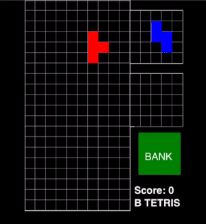

# BTetris
A free-imagination of a certain Soviet game that we all know and love.



# How to build (and run) from source
## Setup
First, make sure [.NET 8 or later](https://learn.microsoft.com/en-us/dotnet/core/install/) is installed on your computer.

## How to Run
Clone the source code and use the `dotnet run` command to run GraphViz:

```
git clone https://github.com/brandonchastain/bTetris.git
cd bTetris/BTetris/
dotnet run
```

You will then be able to play the game in your browser by going to [https://localhost:5008](https://localhost:5008).
